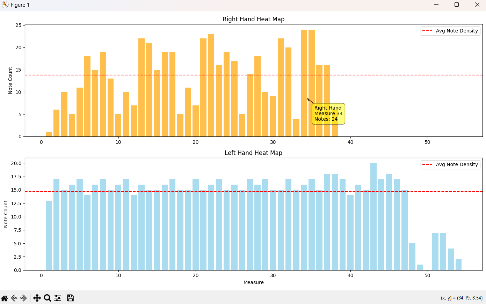
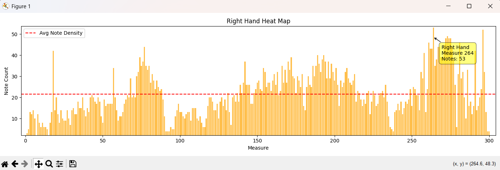
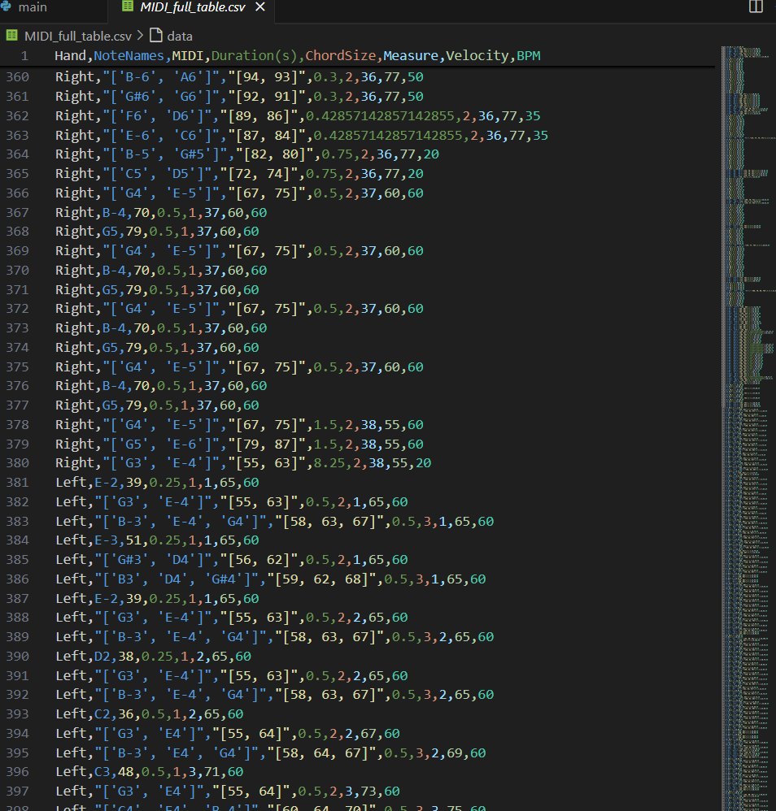

# Piano MIDI Analyser

Extracts note/chord information from MIDI files and generates a heat map of note density for each hand.  
Also saves a CSV dataset of the score for analysis or AI applications.

## How to run

1. Install dependencies: `pip install music21 pandas matplotlib mplcursors`
2. Run `main.py` and select a MIDI file.
3. The heat map will display, and a CSV file `MIDI_full_table.csv` will be saved in the working directory.

## Example Output

- **Heat map per hand**  
  - Separate graphs for Right and Left hands.  
    
  - If the MIDI file has only one part, the program automatically combines both hands into a single heat map.  

----Example below uses Chopin Ballade no.1 in G minor(combined hands) 

- **CSV table** with columns:  
  `Hand, NoteNames, MIDI, Duration(s), ChordSize, Measure, Velocity, BPM`  

## Additional Details

- **Note Density Metric**:  
  The heat map measures the *number of notes (including chord sizes) per measure/bar*, ignoring note duration.  
  This highlights the most technically dense passages for practice or analysis.

- **Tempo Awareness**:  
  Tempo changes are captured from the MIDI and written to the CSV as `BPM`, so duration calculations match the score’s actual tempo map.

- **Interactive Hover**:  
  Hover over bars in the heat map to see the hand, measure number, and note count (requires `mplcursors`).

- **Data Science / ML Ready**:  
  The exported CSV is suitable for downstream tasks like difficulty estimation, feature engineering, or other music-related machine-learning projects.

## Note

- MIDI files occasionally do not specify left and right hand parts.  
  In these cases, the program shows only one heat map and table for the "Right" hand—effectively combining the right and left into one dataset.
